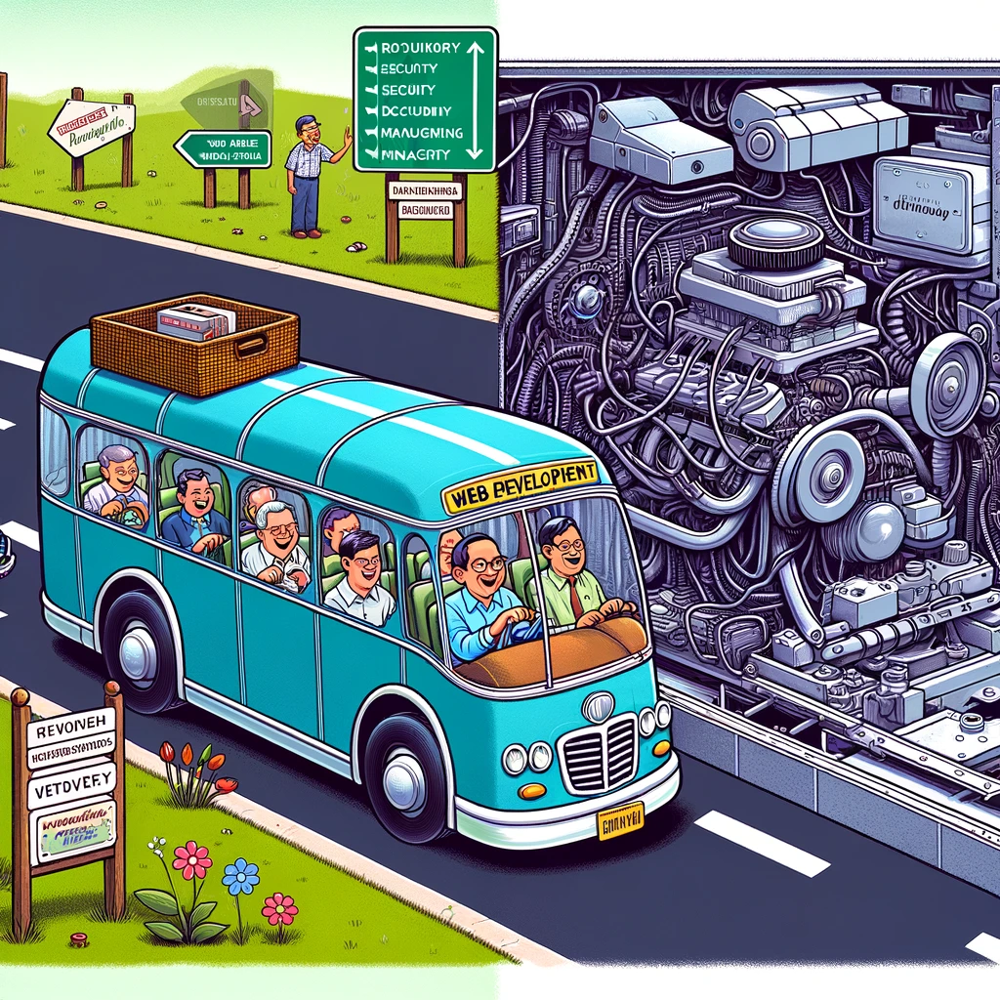

# Web application development on .NET platform
### ASP.NET Core

<script type="module">
  import mermaid from 'https://cdn.jsdelivr.net/npm/mermaid@10/dist/mermaid.esm.min.mjs';
  mermaid.initialize({ startOnLoad: true });
</script>

---

# Web application framework

<div class="columns"><div class="columns-left">

- encapsulates low level operations
  - HTTP, TCP and lower level networking details
  - HTML infrastructure
  - REST communication details
  - server infrastructure
- provides a well defined structure
- offers pre-made blocks for web app creation
- maintainable, scalable, extendable
- lets you focus on your business
- speeds up development

</div><div class="columns-right">
  
</div></div>

---

<div class="columns"><div class="columns-left">

# ASP.NET Core
- Server
  - Kestrel
  - listens to a port
- Context
  - stores all request data
- Pipeline
  - process request

</div><div class="columns-right">

<div class="mermaid" style="width:800;margin-left:-150">
sequenceDiagram
    participant Server as Server (Kestrel)
    participant App as Application
    participant MW1 as Middleware 1
    participant MWn as Middleware N
    Server-->>+App: request
    App->>App: initialize HttpContext
    App-->>+MW1: ProcessRequestAsync
    MW1->>+MWn: next
    MWn-->>-MW1: 
    MW1-->>-App: 
    App-->>-Server: response
</div>

</div></div>

---

<div class="columns"><div class="columns-left">

# Application initialization

- from process start to application start
- defines configuration files (appsettings.json)
- registers types (services) to DI
- adds middleware
- define app endpoints


</div><div class="columns-right"><div class="mermaid">
graph TD;
    B[Create Host Builder] --> C[Configure Host Configuration]
    C --> E[Configure Logging]
    E --> F[Configure Services]
    F --> G[Build Host & Create Application Builder]
    G --> I[Configure Middleware Pipeline]
    I --> J[Configure Endpoints]
</div></div></div>

---

# DI container

<div class="columns"><div class="columns-left">

- allows dependency injection
- maintains dependency instances
- provides extensibility, testability...
<br/>

```csharp
public class Foo {}
public interface IBar {}

public class Baz
{
  public Baz(Foo foo, IBar bar){}
}
```

</div><div class="columns-right"><div class="mermaid" style="margin-left:100">
  graph TD;
      B[create service collection] --> C[register services]
      C -->|transient| C
      C -->|scoped| C
      C -->|singleton| C
      C --> D[build container]
      D --> E[resolve dependencies]
      E --> |resolve dependencies| E
</div><br/>

```csharp
var container = new ServiceCollection()
  .AddSingleton<Bar>()
  .AddScoped<IFoo, MyFoo>()
  .AddTransient<Baz>()
  .Build();

var baz = container.GetService<Baz>();
```

</div></div>


---

# exercise

- pull forked repository `exercises`
- checkout branch `week03`
- create your branch on top of `week03`
- follow `readme.md`
- push and create a pull request
- let others review or find someone to do so

---

# Thank you!

---

# Can AI replace software engineers?

- computers understand computers
- AI can learn any programming language
- you can instruct AI by natural language
- anyone will be able to code with AI
- saves time -> less programmers needed

---

# Can AI replace software engineers?

- computers understand computers
  - analytical vs synthetical thinking
- AI can learn any programming language
  - knowing a language doesn't mean programming
- you can instruct AI by natural language
  - formalization limits
- anyone will be able to code with AI
  - anyone can code even now without AI
- saves time -> less programmers needed
  - this is happening all the time
  - that's what frameworks do

---

# How can AI help then?

- formatting code avoiding bad practices
  - spagetti, astonishing moments, godclasses...
- explaining code parts
- oferring alternatives and patterns
- 1st level reviews
- adding boilerplate