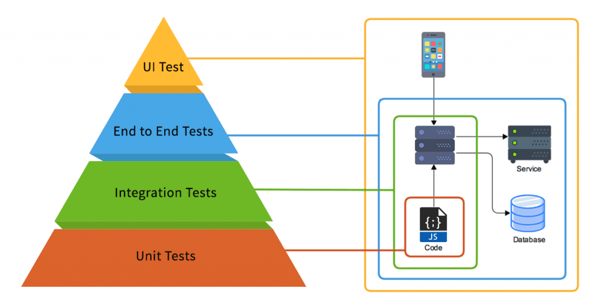

# Web application development on .NET platform
### Testing

<script type="module">
  import mermaid from 'https://cdn.jsdelivr.net/npm/mermaid@10/dist/mermaid.esm.min.mjs';
  mermaid.initialize({ startOnLoad: true });
</script>

---

<div class="columns"><div class="columns-left">

# Cyclomatic complexity

- hard metric
- number of linearly independent branches
  - branch is a sequence of instructions
- exponencial vertically
- bad whatsoever
  - twice as bad for testing


</div><div class="columns-right">

  ```csharp
  public class ShoppingCart
  {
      private PaymentProcessor paymentProcessor = new PaymentProcessor();
      private List<Item> items = new List<Item>();
      private User user;

      public ShoppingCart(User user)
      {
          User = user;
      }

      public void Add(Item item)
      {
         if (!items.Contains(ordered => ordered == item))
         {
             items.Add(item);
         }
      }

      public Remove(Item item) => items.TryRemove(item, out _);

      public Order Checkout()
      {
          if (CheckAvailability() && paymentProcessor.ChargeAndValidate(user))
          {
              var order = new Order(items);
              order.Settle(user);
              return order;
          }
      }

      private bool CheckAvailability()
      {
          foreach (var item in items)
          {
            if (!item.CheckAvailability()){
              items.Remove(item);
            }
          }

          return items.Any();
      }
  }
  ```

</div></div>

---

# Unit Test

<div class="columns"><div class="columns-left">

- one logical body
- proves correctness of the body
- the simpler the better
- maintainable only for low complexity
- fast execution
- high quantity
- tests all branches
- uses test doubles

</div><div class="columns-right">
  
</div></div>

---

<div class="columns"><div class="columns-left">

# Integration test
- whole component scope
- proves defined component behaviour
- still reasonably fast
- tests only selected branches
- uses tests doubles
- bends untested component parts
- petrifies project

</div><div class="columns-right">
  
</div></div>

---

<div class="columns"><div class="columns-left">

# end to end test

- user-story scope
- proves edge API works as expected
- slow and expensive
- tests only happy paths
- no doubles, no bends
- test from user perspective


</div><div class="columns-right">
  
</div></div>

---

# XUnit test framework

<div class="columns"><div class="columns-left">

- created by original NUnit author
- class-first testing
  - using constructors for setup
  - using Dispose for teardown
  - creating a test instance for each test
- extendable assertion library


</div><div class="columns-right">

```csharp
public class CalculatorTests
{
    [Fact]
    public void CanAddNumbers()
    {
        var calculator = new Calculator();
        var result = calculator.Add(2, 2);
        Assert.Equal(4, result);
    }

    [Theory]
    [InlineData(2, 2, 4)]
    [InlineData(2, -2, 0)]
    [InlineData(-2, -2, -4)]
    public void CanAddNumbers(int a, int b, int expected)
    {
        var calculator = new Calculator();
        var result = calculator.Add(a, b);
        Assert.Equal(expected, result);
    }
}
```

</div></div>

---

# Test doubles

<div class="columns"><div class="columns-left">

- stubs
  - fulfill contract with no real implementation
  - usually return the same data whatever comes
- mocks
  - pre-programmed or validatable stubs
  - most libraries offer mocks
- fakes
  - have (likely simplified) implementation

</div><div class="columns-right">

```csharp
public interface IWeatherService {
    WeatherReport GetWeatherReport(string location);
}

public class WeatherServiceStub : IWeatherService {
    public WeatherReport GetWeatherReport(string location) {
        return new WeatherReport {
            Location = location,
            Temperature = 75, // Fixed temperature
            Condition = "Sunny"
        };
    }
}

var weatherServiceMock = NSubstitute.For<IWeatherService>();

var fakeDbContextOptions = new DbContextOptionsBuilder<YourDbContext>()
    .UseInMemoryDatabase(databaseName: "TestDatabase")
    .Options;
```

</div></div>

---

# NSubstitute

<div class="columns"><div class="columns-left">

- replaces Moq
  - no data collection
- class-first testing
  - using constructors for setup
  - using Dispose for teardown
  - creating a test instance for each test
- extendable assertion library


</div><div class="columns-right">

```csharp
public interface ICalculator
{
    string Mode { get; set; }

    int Add(int a, int b);
    int Multiply(int a, int b);
}

calculator.Add(1, 2).Returns(3);

Assert.AreEqual(3, calculator.Add(1, 2)); // true
Assert.AreEqual(3, calculator.Add(0, 3)); // false

calculator.Add(Arg.Any<int>(), Arg.Any<int>()).Returns(3);

Assert.AreEqual(3, calculator.Add(1, 2)); // true
Assert.AreEqual(3, calculator.Add(0, 3)); // true
Assert.AreEqual(3, calculator.Add(5, 3)); // true

calculator.Received(2).Add(1, 2);
calculator.Received(1).Add(1, 2); // throws

calculator.Mode = "HEX";

calculator.Received().Mode = "HEX";
```

</div></div>

---

<div class="columns"><div class="columns-left">

# ASP.NET Core
- Server
  - Kestrel
  - listens to a port
- Context
  - stores all request data
- Pipeline
  - process request

</div><div class="columns-right">

<div class="mermaid" style="width:800;margin-left:-150">
sequenceDiagram
    participant Server as Server (Kestrel)
    participant App as Application
    participant MW1 as Middleware 1
    participant MWn as Middleware N
    Server-->>+App: request
    App->>App: initialize HttpContext
    App-->>+MW1: ProcessRequestAsync
    MW1->>+MWn: next
    MWn-->>-MW1: 
    MW1-->>-App: 
    App-->>-Server: response
</div>

</div></div>

---

# Testing ASP.NET Core

<div class="columns"><div class="columns-left">

- fakes server part
- HttpContext inserted directly into application
- hooks to override application initialization
- we need an HttpClient
- can't test some aspects


</div><div class="columns-right">

```csharp
public class IntegrationTests : WebApplicationFactory<Startup>
{
    protected override void ConfigureWebHost(IWebHostBuilder builder)
    {
        builder.ConfigureServices(services =>
        {
            // Configure services for testing if needed
        });
    }
}

public class BasicTests : IClassFixture<IntegrationTests>
{
    private readonly HttpClient _client;

    public BasicTests(IntegrationTests factory)
    {
        _client = factory.CreateClient();
    }

    [Fact]
    public async Task HomePage_ShouldReturnSuccessStatusCode()
    {
        // Arrange
        var request = "/"; // URL to test

        // Act
        var response = await _client.GetAsync(request);

        // Assert
        response.EnsureSuccessStatusCode(); // Status Code 200-299
    }
}
```

</div></div>

---

# exercise

- pull forked repository `exercises`
- ensure you merged your exercise to `week03` branch
- create your branch on top of updated `week03` branch
- basically, write tests for your implementation
  - unit tests
  - integration tests
  - end to end tests
- push and create a pull request
- let others review or find someone to do so

---

# Thank you!

---

# To test or not to test?

<div class="columns"><div class="columns-left">

- testing costs money
  - development time
- testing saves money
  - bugs and regression caching
  - testing in production is EVIL!!!
- testing forces good code structure
  - hacks are tough to test
  - mockable allocations

- what is the complexity testers face?
  - almost undoable for big tech


</div><div class="columns-right">


</div></div>
