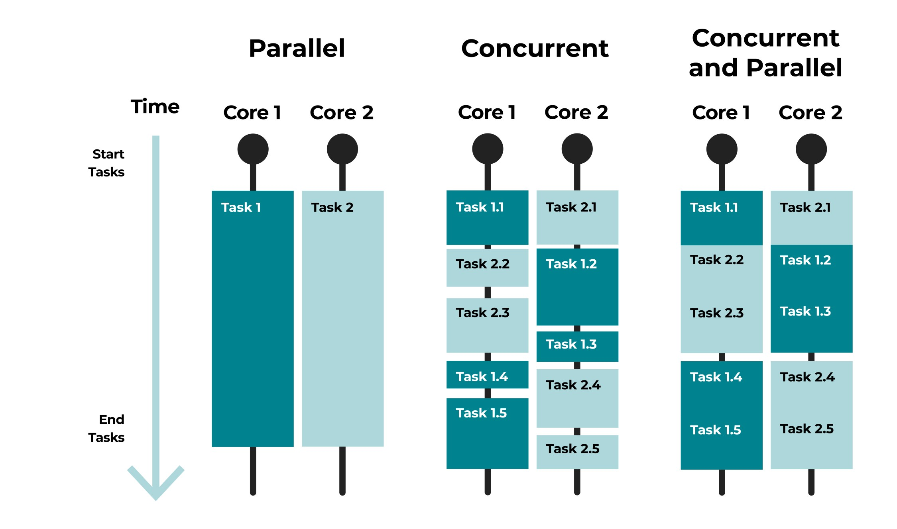

# Web application development on .NET platform
### Async calls, threads and backend services

<script type="module">
  import mermaid from 'https://cdn.jsdelivr.net/npm/mermaid@10/dist/mermaid.esm.min.mjs';
  mermaid.initialize({ startOnLoad: true });
</script>

---

# Thread and concurrent execution

<div class="columns"><div class="columns-left">

- thread of execution
  - smallest execution unit for OS
- allows concurrent execution
- can yield CPU allocation
- OS handles thousands of threads
- too many threads hurt performance
  - OS keeps list of their context
  - kernel / user switches clean CPU cache

</div><div class="columns-right">



</div></div>

---

# Task is just a promise

<div class="columns"><div class="columns-left">

- a reference
- a callback
- compiler does the heavy lifting

```csharp
public async Task<bool> AuthorizeUser(User user)
{
    try
    {
      var credentials = await credentialManager.GetCredentials(user);
      return await authClient.Authenticate(credentials);
    }
    catch
    {
      /*code*/
    }
}
```

</div><div class="columns-right">
  
```csharp
public class Task
{
  public void Start();
  public AggregateException? Exception { get { /*code*/ } }
  public TaskStatus Status { get { /*code*/ } }
  public bool IsCompleted { get { /*code*/ } }
  public TaskAwaiter GetAwaiter() { /*code*/ }
}

public class Task<TResult> : Task
{
  public TResult Result { get { /*code*/ } }
}

public readonly struct TaskAwaiter<TResult> : ICriticalNotifyCompletion, ITaskAwaiter
{
    public bool IsCompleted => m_task.IsCompleted;
    public void OnCompleted(Action continuation) { /*code*/ }
    public void UnsafeOnCompleted(Action continuation) { /*code*/ }
    public TResult GetResult() { /*code*/ }
}
```

</div></div>

---

# Thread safety in ASP.NET Core

<div class="columns"><div class="columns-left">

- each request runs on a single thread
  - transient and scoped services are fine
- singleton services may suffer race conditions
  - avoid thread specific state
  - use HttpContext to store state
  - use locks and other thread primitives
  - extract state to a scoped service

</div><div class="columns-right">
  
</div></div>

---

<div class="columns"><div class="columns-left">

# locking

- slow
- tricky to
  - reason
  - debug
  - test
- deadlocks
- lifelocks
- use alternatives
  - lock-less design
  - CAS instruction
  - spinlocks

</div><div class="columns-right">

```csharp
public class Deadlock
{
    private static readonly object Lock1 = new();
    private static readonly object Lock2 = new();

    public void Run()
    {
        var thread1 = new Thread(() => RunThreadA("Thread 1"));
        var thread2 = new Thread(() => RunThreadB("Thread 2"));

        thread1.Start();
        thread2.Start();

        thread1.Join();
        thread2.Join();
    }

    private static void RunThreadA(string threadName)
    {
        lock (Lock1)
        {
            Console.WriteLine(  $"{threadName} acquired {nameof(Lock1)}");
            Thread.Sleep(100);

            lock (Lock2)
            {
                Console.WriteLine(  $"{threadName} acquired {nameof(Lock2)}");
            }
        }
    }

    private static void RunThreadB(string threadName)
    {
        lock (Lock2)
        {
            Console.WriteLine(  $"{threadName} acquired {nameof(Lock2)}");
            Thread.Sleep(100);

            lock (Lock1)
            {
                Console.WriteLine(  $"{threadName} acquired {nameof(Lock1)}");
            }
        }
    }
}
```

</div></div>

---

# Background services

<div class="columns"><div class="columns-left">

- long runnint jobs
  - consuming a queue
  - updating service
- maintenance purposes
- don't depend on API calls
- use `IHostedService` interface
- cold-path

</div><div class="columns-right">

```csharp
public class CurrentTimeBackgroundService : BackgroundService
{
    private readonly ILogger _logger;

    public CurrentTimeBackgroundService(ILogger<CurrentTimeBackgroundService> logger)
    {
        _logger = logger;
    }

    protected override async Task ExecuteAsync(CancellationToken stoppingToken)
    {
        while (!stoppingToken.IsCancellationRequested)
        {
            _logger.LogInformation("Current time: {time}", DateTimeOffset.Now);
            await Task.Delay(1000, stoppingToken);
        }
    }
}
```

---

# NuGet packages

<div class="columns"><div class="columns-left">

- package manager
- automates package management
  - automatic updates
  - dependency management
  - caches multiple levels
- NuGet.org has loads of packages
- supported versions
- license terms


</div><div class="columns-right">

```zsh
# list all installed packages

dotnet list package


# adds or updates a package

dotnet add package Microsoft.EntityFrameworkCore


# removes a package

dotnet remove package Microsoft.EntityFrameworkCore
```

</div></div>

---

# NuGet version constraints

<div class="columns"><div class="columns-left">

- limit applicable versions
- better don't use
  - diamond problem

<div style="width:100%;font-size:14px">

| Notation     | Applied rule       | Description           |
|--------------|--------------------|-----------------------|
| 1.0          | x ≥ 1.0            | Min version, incl     |
| [1.0,)       | x ≥ 1.0            | Min version, incl     |
| (1.0,)       | x > 1.0            | Min version, excl     |
| [1.0]        | x == 1.0           | Exact version match   |
| (,1.0]       | x ≤ 1.0            | Max version, incl     |
| (,1.0)       | x < 1.0            | Max version, excl     |
| [1.0,2.0]    | 1.0 ≤ x ≤ 2.0      | Exact range, incl     |
| (1.0,2.0)    | 1.0 < x < 2.0      | Exact range, excl     |
| [1.0,2.0)    | 1.0 ≤ x < 2.0      | incl min and excl max |
| (1.0)        | invalid            | invalid               |

</div>

</div><div class="columns-right">

<div class="mermaid" style="width:800;">
graph TD;
    A(Application) -->|1.1| B(NetForce.HealthChecks)
    A -->|3.8| C(Microsoft.Identity)
    B -->|"[1.0]"| D
    C -->|2.0| D(NewtonSoft.Json)
    class A,B,C normal;
    class D conflict;
</div>

</div></div>

---

# exercise

- pull forked repository `exercises`
- ensure you merged your exercise to `week05` branch
- create your branch on top of updated `week05` branch
- create a backend service to
  - mark incomplete past due todo items as priority 1
  - mark incomplete due today todo items as priority 2
  - mark incomplete due tomorrow todo items as priority 3
- write tests for the backend service
- push and create a pull request
- let others review or find someone to do so

---

# Thank you!

---

<div class="columns"><div class="columns-left">

# Useful tools

- Postman
  - REST client
- Fiddler
  - intercepts network calls
- LINQPad
  - prototyping LINQ queries
- PowerShell Core
  - multiplatform, nice gallery
- dotPeek by JetBrains
  - C# decompiler

</div><div class="columns-right">

# Useful VS Code plugins

- GitLens
  - more git features
- Mermaid
  - create charts by code
- MARP for VS Code
  - Markdown presentations
- PowerShell
  - almost IDE feeling
- Copilot
  - trained on GitHub

</div></div>
