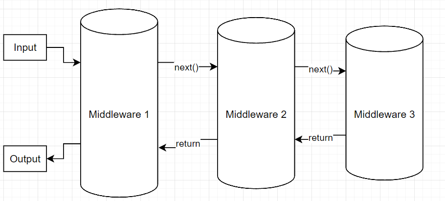
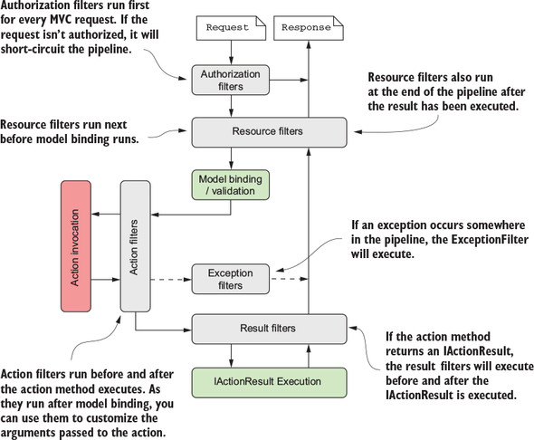

# Web application development on .NET platform
### Middlewares and filters

<script type="module">
  import mermaid from 'https://cdn.jsdelivr.net/npm/mermaid@10/dist/mermaid.esm.min.mjs';
  mermaid.initialize({ startOnLoad: true });
</script>

---

# pipeline

<div class="columns"><div class="columns-left">

- one or more middlewares
- in & out control
- loose coupling
- extensible
- resilient

</div><div class="columns-right">



</div></div>

---

# middleware

<div class="columns"><div class="columns-left">

- calls next middleware
- returns to previous middleware
- typically a singleton
- hot-path
- constructor parameters
  - RequestDelegate always first
  - different resolution

</div><div class="columns-right">

```csharp
public class LatencyMiddleware
{
    private readonly RequestDelegate _next;

    public LatencyMiddleware(RequestDelegate next)
    {
        _next = next;
    }

    public async Task InvokeAsync(HttpContext context)
    {
        var watch = Stopwatch.StartNew();
        await _next(context); 
        watch.Stop();

        context.Response.Headers.Add("X-Response-Time-Ms", $"{watch.ElapsedMilliseconds}");
    }
}

public delegate Task RequestDelegate(HttpContext context);

Func<HttpContext, Task> next = context => Task.CompetedTask;
```

</div></div>

---

# Filters

<div class="columns"><div class="columns-left">

- closer focus
- action related
- dynamically invoked
- any scope
- two invocations
  - global filters
  - attributes

</div><div class="columns-right">



</div></div>

---

# filter types

<div class="columns"><div class="columns-left">

- IAuthorizationFilter
  - can short-circuit request
- IResourceFilter
  - caching, logging
- IActionFilter
  - runs directly before action
  - data processing
- IExceptionFilter
- IResultFilter
  - result post-processing

</div><div class="columns-right">

```csharp
public class AuthorizeAdminRoleAttribute : AuthorizeAttribute
{
    public AuthorizeAdminRoleAttribute() : base(Roles = "Admin") { }
}

public class CacheResourceAttribute : Attribute, IResourceFilter
{
    public void OnResourceExecuting(ResourceExecutingContext context) { /* Add caching logic here */ }
    public void OnResourceExecuted(ResourceExecutedContext context) { }
}

public class LogActionTimeAttribute : ActionFilterAttribute
{
    public override void OnActionExecuting(ActionExecutingContext context)
    {
        // Log start time
    }

    public override void OnActionExecuted(ActionExecutedContext context)
    {
        // Log end time and calculate duration
    }
}

public class HandleExceptionAttribute : ExceptionFilterAttribute
{
    public override void OnException(ExceptionContext context)
    {
        // Log exception and set context.Result to a custom error view
    }
}

public class AddCustomHeaderAttribute : ResultFilterAttribute
{
    public override void OnResultExecuting(ResultExecutingContext context)
    {
        context.HttpContext.Response.Headers.Add("X-Custom-Header", "Value");
    }

    public override void OnResultExecuted(ResultExecutedContext context) { }
}

```

</div></div>

---

# Request

<div class="columns"><div class="columns-left">

- Method
- URL
- Headers
- body

</div><div class="columns-right">

```makefile
POST /api/greeting HTTP/1.1
Host: www.example.com
Content-Type: application/json
Accept: application/json
Content-Length: 27

{
  "message": "Hello World"
}
```

</div></div>

---

# HttpRequest

<div class="columns"><div class="columns-left">

- represents HTTP request
- stores request parts
- additional data
  - cookies
  - connection information

</div><div class="columns-right">

```csharp
var context = new DefaultHttpContext();

context.Request.Method = "GET";
context.Request.Path = "/api/values";
context.Request.QueryString = new QueryString("?query=123");

context.Request.Headers["Content-Type"] = "application/json";

var requestBody = "{\"name\":\"Test User\"}";
var memoryStream = new MemoryStream(Encoding.UTF8.GetBytes(requestBody));
memoryStream.Position = 0; 

context.Request.Body = memoryStream;

context.Request.Query = new QueryCollection(
  new Dictionary<string, Microsoft.Extensions.Primitives.StringValues>
{
    { "query", "123" }
});

return context;
```

</div></div>

---

# Request headers

<div class="columns"><div class="columns-left">

- Request.Headers
- permissive
  - no throw on missing key
- return StringValues struct
- don't change them


</div><div class="columns-right">

```csharp
public async Task InvokeAsync(HttpContext context)
{
    var date = context.HttpContext.Request.Headers.Date;
    var myHeader = context.HttpContext.Request.Headers["MyHeader];

    context.Request.Headers.TryGetValue("Language", out var language) {
      SetLanguage(language);
    }

    foreach (var id in context.Request.Headers["Ids"]) {
      LogIdUsed(id);
    }

    /*...*/
}
```

</div></div>

---

# Path & query

<div class="columns"><div class="columns-left">

  - http(s)://hostname[:port]/path?querystring#fragment
    - path base: protocol, host, port
    - path
    - query
    - fragment
  - RFC 3986
  - watch out trailing slashes


</div><div class="columns-right">

```csharp
public class PathExampleMiddleware
{
    private readonly RequestDelegate _next;

    public PathExampleMiddleware(RequestDelegate next)
    {
        _next = next;
    }

    public async Task Invoke(HttpContext context)
    {
        if (context.Request.Path.StartsWithSegments("/api"))
        {
            await context.Response.WriteAsync("API request detected");
        }
        else
        {
            await _next(context);
        }
    }
}
```

</div></div>

---

# query

<div class="columns"><div class="columns-left">

- key/value pairs
- separated by '&'
- divided by '?' from path
- divided by '#' from fragment
- implemented by IQueryCollection


</div><div class="columns-right">

```csharp
// https://dotnet.com/api/news?language=en
var queryValue = HttpContext.Request.Query["language"];
Console.WriteLine($"Query value: {queryValue}");

// https://dotnet.com/api/articles?tag=aspnet&tag=core
var tags = HttpContext.Request.Query["tag"];
foreach (var tag in tags)
{
    Console.WriteLine($"Tag: {tag}");
}
```

</div></div>

---

# body

<div class="columns"><div class="columns-left">

- a stream
- many formats
  - bytes, string, form
  - specified by Content-Type header
- may be very long
- many attack vectors
  - check Content-Length header

</div><div class="columns-right">

```csharp
// enable others to read the body, but don't use with
// large bodies
HttpContext.Request.EnableBuffering();

using var reader = new StreamReader(HttpContext.Request.Body);
var body = await reader.ReadToEndAsync();

// others will start reading the stream from start
HttpContext.Request.Body.Position = 0

```

</div></div>

---

# deserialization

<div class="columns"><div class="columns-left">

- System.Text.Json
  - built in library
  - goto library nowadays
- deserializes from
  - string
  - stream
- deserializes to
  - type
  - struct
  - record
</div><div class="columns-right">

```csharp
public class Person
{
    public string Name { get; set; }
    public int Age { get; set; } 
}

var options = new JsonSerializerOptions
{
    PropertyNameCaseInsensitive = true,
};

var jsonString = "{\"Name\":\"John Doe\", \"Age\":30}";
var person = JsonSerializer.Deserialize<Person>(jsonString);

using (var stream = File.OpenRead("path_to_file.json"))
{
    var person = await JsonSerializer.DeserializeAsync<Person>(stream);
}

try
{
    var person = JsonSerializer.Deserialize<Person>(jsonString);
}
catch (JsonException ex)
{
    // Handle parsing errors
}
```

</div></div>

---

# Response

<div class="columns"><div class="columns-left">

- status
- headers
- body
  - format set by Content-Type header

</div><div class="columns-right">

```makefile
HTTP/1.1 200 OK
Date: Wed, 21 Oct 2020 07:28:00 GMT
Content-Type: application/json; charset=UTF-8
Content-Length: 85

{
  "userId": 1,
  "id": 1,
  "title": "Example",
  "body": "This is a JSON response example."
}
```

</div></div>

---

# HttpResponse

<div class="columns"><div class="columns-left">

- represents HTTP response
- once started, nothing but body can be changed
  - client already has it
  - client doesn't have to await body

</div><div class="columns-right">

```csharp
context.Response.StatusCode = 200;
context.Response.ContentType = "text/html";
await Response.WriteAsync("<html><body><p>Hello, World!</p></body></html>");
context.Response.Cookies.Append("sessionId", "12345");
context.Response.Headers.ContentType = "application/json";

```

</div></div>

---

# response status

<div class="columns"><div class="columns-left">

- Categorized into 5 classes:
  - 1xx: Informational
  - 2xx: Success
  - 3xx: Redirection
  - 4xx: Client Error
  - 5xx: Server Error

- if > 399, add detailed reason
  - caller needs to know what happens

</div><div class="columns-right">

- 200 OK
- 201 Created
- 202 Accepted
- 204 No Content
- 400 Bad Request
- 401 Unauthorized
- 403 Forbidden
- 404 Not Found
- 500 Internal Server Error

</div></div>

---

# serialization

<div class="columns"><div class="columns-left">

- System.Text.Json
- deserializes from
  - type, struct, record
- deserializes to
  - string, stream
- be aware of
  - data leaks
  - property name casing
  - cycles in properties
    - Exception classes

</div><div class="columns-right">

```csharp
var options = new JsonSerializerOptions
{
    WriteIndented = true,
    PropertyNamingPolicy = JsonNamingPolicy.CamelCase
};

var product = new Product { Id = 1, Name = "Laptop", Price = 999.99M };
var jsonString = JsonSerializer.Serialize(product, options);


usingvar stream = new FileStream(filePath, FileMode.Create, FileAccess.Write);
await JsonSerializer.SerializeAsync(stream, person);
```

</div></div>

---

# Thank you!
