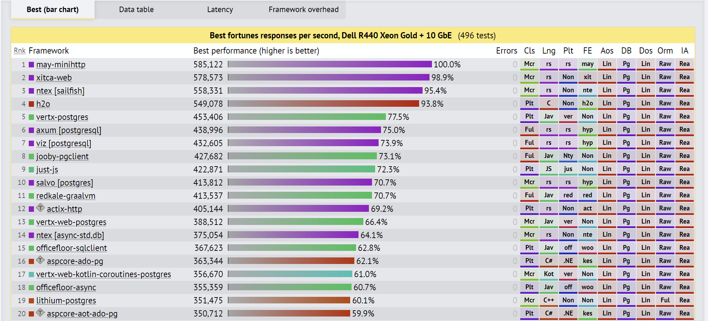

# Web application development on .NET platform
### introduction

<script type="module">
  import mermaid from 'https://cdn.jsdelivr.net/npm/mermaid@10/dist/mermaid.esm.min.mjs';
  mermaid.initialize({ startOnLoad: true });
</script>

---

# Why should I attend this course

<div class="columns"><div class="columns-left">

## costs

- takes time
  - 16,5 hours of lessons
  - approx 30 hours of homeworks
- compromises around external teacher
  - limited consultations
  - delays

</div><div class="columns-right">

## benefits

- C#
  - design
  - build
  - execution
- ASP.NET web application
  - one framework, one web server
  - loved by enterprise
- a voice from trenches

</div></div>

---

# What we need?

<div class="columns"><div class="columns-left">

## knowledge

- any language with C-like syntax
  - ideally C# `Perfect model of a cat is another, ideally the same cat.`
  - or Java
- git
  - limited consultations
  - delays

</div><div class="columns-right">

## software

- dotnet8.0 => C# 12
- IDE
  - Visual Studio Code
    - C# Dev Kit Extension
  - Visual Studio
  - Jetbrains Rider
- git & GitLab account

</div></div>

---

# C++ (1985)

<div class="columns" style="height:100%"><div class="columns-left">

- compiles to machine code
  - compiled on dev machine
    - target architecture
  - shared
  - copied to target machine
  - executed
    - architecture must match
- pointers, structs...

</div><div class="columns-right"><div class="mermaid">
  block-beta
    columns 1
    block:group1:1
      application
      runtime
    end
    blockArrowId6<["&nbsp;&nbsp;&nbsp;"]>(down)
    target["target"]
</div></div></div>

---

# Java (1995)

<div class="columns" style="height:100%"><div class="columns-left">

- compiles to bytecode
  - compiled on dev machine
  - shared
  - copied to target machine
  - executed
    - JRE must be installed
- package management, reflection, garbage collector...

</div><div class="columns-right"><div class="mermaid">
    block-beta
    columns 1
    application
    blockArrowId6<["&nbsp;&nbsp;&nbsp;"]>(down)
    block:group1:1
      target_machine["target machine"]
      runtime
    end
</div></div></div>

---

# C# (2000)

<div class="columns"><div class="columns-left">

- Microsoft's Java
  - intermediary language (IL)
  - class first
  - garbage collected
- managed C++
  - pointers, P/Invoke
  - preprocessor directives
  - structs, properties, events
- strongly and statically typed
- general purpose & multi-paradigm
</div><div class="columns-right">


</div></div>

---

<div class="columns"><div class="columns-left">

# C# execution

- C# language
  - frontend for CIL
- CIL
  - stack language
- CLR
  - thread management
  - garbage collection
  - type-safety
  - exception handling

</div><div class="columns-right"><div class="mermaid">
  graph TD
    C1[("C# code")] -->|Compiles| A1[("C# compiler")]
    C2[("F# code")] -->|Compiles| A2[("F# compiler")]
    C3[("VB code")] -->|Compiles| A3[("VB compiler")]
    A1 --> B[("Common Intermediate Language (CIL)")]
    A2 --> B
    A3 --> B
    B --> D[("Common Language Runtime (CLR)")]
    D --> E[("Machine Code")]
</div></div></div>

---

# C# Development platforms

<div class="columns"><div class="columns-left">

## dotnet

- modern
- cross-platform
- open-source

</div><div class="columns-right">

## .NET Framework

- legacy
- Windows only
- proprietary
- still part of Windows

</div></div>

---

# C# use-cases

<div class="columns"><div class="columns-left">

## where it shines

- web & desktop services
  - JIT compilation compensated
  - ASP.NET Core
- desktop clients
  - WPF & UWP, many tools
  - Windows native
- games
  - Unity engine
  - lot of hacks
  - rather smaller games

</div><div class="columns-right">

## where it lags behind

- OS level programming
  - memory overhead
  - performance
- custom automation
  - startup speed
  - compiled
- scientific tools
  - small community
- supercomputers
  - not a pure functional language
</div></div>

---

# C# Solution

<div class="columns"><div class="columns-left">

- top level concept
- contains
  - solution structure
    - project paths
  - build configuration

```csharp
dotnet new solution --name week1
```

</div><div class="columns-right">

```txt
Microsoft Visual Studio Solution File, Format Version 12.00
# Visual Studio Version 17
VisualStudioVersion = 17.0.31903.59
MinimumVisualStudioVersion = 10.0.40219.1
Global
	GlobalSection(SolutionConfigurationPlatforms) = preSolution
		Debug|Any CPU = Debug|Any CPU
		Release|Any CPU = Release|Any CPU
	EndGlobalSection
	GlobalSection(SolutionProperties) = preSolution
		HideSolutionNode = FALSE
	EndGlobalSection
EndGlobal
```

</div></div>

---

# Project

<div class="columns"><div class="columns-left">

- organization unit
- information about
  - projects
  - build configuration
  - solution structure
- should be in a folder with the same name

```powershell
dotnet new console --name week1.cli --output src/week1.cli
dotnet sln week1.sln add ./src/week1.cli/week1.cli.csproj
```

</div><div class="columns-right">

```xml
<Project Sdk="Microsoft.NET.Sdk">

  <PropertyGroup>
    <OutputType>Exe</OutputType>
    <TargetFramework>net8.0</TargetFramework>
    <ImplicitUsings>enable</ImplicitUsings>
    <Nullable>enable</Nullable>
  </PropertyGroup>

</Project>
```

</div></div>

---

# Program.cs

- entry point
- reads calling command from shell
  - split by spaces to a string array

<div class="columns"><div class="columns-left">

## modern

```csharp
// See https://aka.ms/new-console-template for more information
Console.WriteLine("Hello, World!");
```

</div><div class="columns-right">

## legacy

```csharp
namespace week1b
{
    internal class Program
    {
        static void Main(string[] args)
        {
            Console.WriteLine("Hello, World!");
        }
    }
}
```

</div></div>

---

# /obj folder

<div class="columns"><div class="columns-left">

- used by build
  - restore information
  - intermediate files
  - assembly info
  - debug info
  - caches
- can be deleted anytime
  - only way to invalidate the caches

</div><div class="columns-right">

```
~\src\week1.cli\obj> dir

Name
----
project.assets.json
project.nuget.cache
week1.cli.csproj.nuget.dgspec.json
week1.cli.csproj.nuget.g.props
week1.cli.csproj.nuget.g.targets
```

</div></div>

---

# dotnet build

<div class="columns"><div class="columns-left">

- uses Roslyn compiler
- traverse solution
- collects configuration
  - .sln
  - .csproj
  - .targets
  - .props
- runs analyzers
- builds to /bin folder

</div><div class="columns-right"><div class="mermaid">
  block-beta
    columns 5
    id1("Roslyn compiler pipeline"):5
    block:group1:5
      parser
      block:group2:1
        columns 1
        symbols
        Metadata("Metadata Import")
      end
      Binder
      IL
      Emitter
    end
    style id1 fill:none,stroke-width:0px
</div></div></div>

---

# /bin folder

<div class="columns"><div class="columns-left">

- build artifacts
  - configuration/framework subfolders
  - build cache
- can be deleted anytime

</div><div class="columns-right">

```
~\src\week1.cli\bin\Debug\net8.0> dir

Name
----
week1.cli.deps.json
week1.cli.dll
week1.cli.exe
week1.cli.pdb
week1.cli.runtimeconfig.json
```

</div></div>

---

# Program.cs

- entry point
- reads calling command from shell
  - split by spaces to a string array

<div class="columns"><div class="columns-left">

## modern

```csharp
// See https://aka.ms/new-console-template for more information
Console.WriteLine("Hello, World!");
```

</div><div class="columns-right">

## legacy

```csharp
using system;

namespace week1b
{
    internal class Program
    {
        static void Main(string[] args)
        {
            Console.WriteLine("Hello, World!");
        }
    }
}
```

</div></div>

---

# dotnet run

- resolves dependencies
- builds application
- runs application


```powershell
PS ~\week1> dotnet run --project .\src\week1.cli\week1.cli.csproj
Hello, World!
```

---


# reading arguments from console

- we use the args parameter

```csharp
static void Main(string[] args)
{
    foreach (var arg in args)
    {
      Console.WriteLine(arg);
    }
}
```

```powershell
PS ~\week1> dotnet run --project .\src\week1.cli\week1.cli.csproj -- dotnet rulez
dotnet
rulez
```

---

# exercise

- install dotnet8.0
- pick an IDE and install it
- install git
- create new console project working with arguments
- enjoy your life
<br/>
- likely
  - fork repository under the same project as exercises-{your alias}
  - create branch from week1 as `week1/your-alias` (week1/ruzj16)
  - commit & push & create a pull request

---

# Is C# better than other languages?

- is programming language important?

<div class="columns"><div class="columns-left">

# no

- it's about thinking, not coding
- get the right tool for the job
- all languages are quite similar
- personal preferences

</div><div class="columns-right">

# yes

- development pace
- learning curve
- maturity
- platform
- job offers

</div></div>

---

# Performance?

<a href="https://www.techempower.com/benchmarks/#hw=ph&test=fortune&section=data-r22">Web Framework Benchmarks</a>

</iframe>

---

<div class="columns"><div class="columns-left">

# C#

- less verbose
- 7 years of experience rewrite
- simpler and redesigned VM
- excellent garbage collector
- consistent and opinionated libraries
- large investments
- true generics

</div><div class="columns-right">

# Java

- huge community
- independent (Open JDK)
- more job opportunities
- JVM language family

</div></div>

---

<div class="columns"><div class="columns-left">

# C#

- better development pace
- better compile times
- mature ecosystem
- backed by a big tech
- more job offers
- reflection
- better tooling

</div><div class="columns-right">

# Rust

- much better startup time
- independent
- low-level if needed
- LLVM (access to its tooling, WASI...)
- cool

</div></div>

---

<div class="columns"><div class="columns-left">

# C#

- backed by Microsoft
- enterprise mindset
- virtual machine
- better reflection, code generation, analyzers

</div><div class="columns-right">

# Go

- backed by Google
- startup mindset
- ahead of time (AOT) compilation
- better default tooling
- awesome compilation times

</div></div>

---

<div class="columns"><div class="columns-left">

# C#

- backed by Microsoft
- faster
- strongly and statically typed
- backend, gaming

</div><div class="columns-right">

# JavaScript

- everywhere
- simple
- invincible community and package numbers
- frontend, automation

</div></div>

---

# Thank you!

---